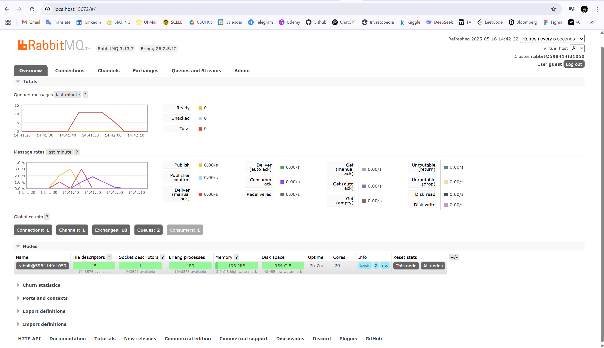

## a. What is amqp?

AMQP (Advanced Message Queuing Protocol) is an open standard messaging protocol that enables asynchronous communication between applications via message queues. It is commonly used with message brokers like RabbitMQ to support reliable message delivery, persistence, routing, and decoupled communication between systems.

## b. What does it mean? guest:guest@localhost:5672 , what is the first guest, and what is the second guest, and what is localhost:5672 is for?

- The first guest is the username used to authenticate the connection to the message broker.

- The second guest is the password for that user.

- localhost refers to the host address where the message broker (e.g., RabbitMQ) is running. localhost means it's running on the same machine.

- 5672 is the default port used by AMQP to accept non-SSL connections.

## Simulating a Slow Subscriber

To simulate a slow subscriber, I enabled a delay in the message handler by uncommenting the `thread::sleep(...)` line in `main.rs`.

Then, I ran the publisher several times quickly using `cargo run` in a short span of time.

As a result, RabbitMQ temporarily queued incoming messages because the subscriber could not consume them immediately. This caused a visible spike in the Queued messages chart in RabbitMQ's dashboard.

On my machine, the maximum queued messages at one point was approximately 12. This value depends on how fast and how many times the publisher sends messages, and how slow the subscriber processes them.

Below is a screenshot showing the queue build-up:

